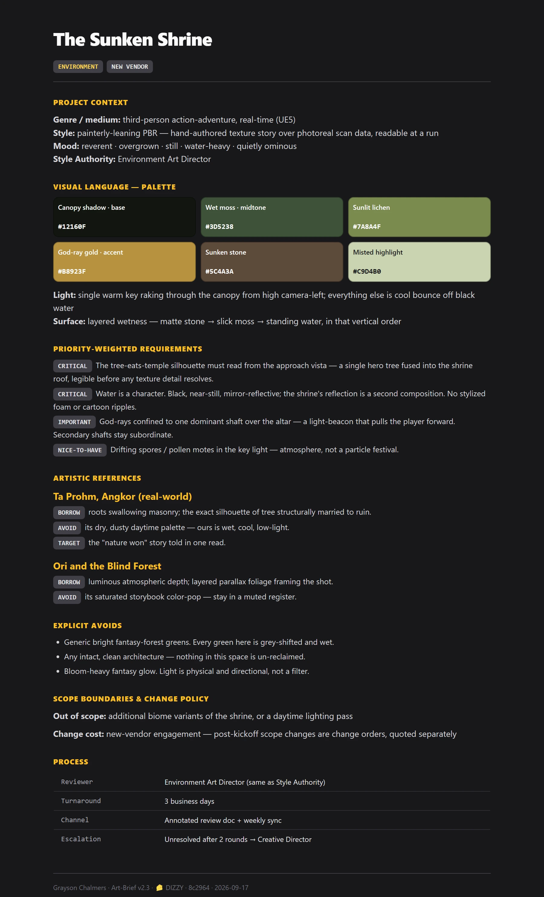
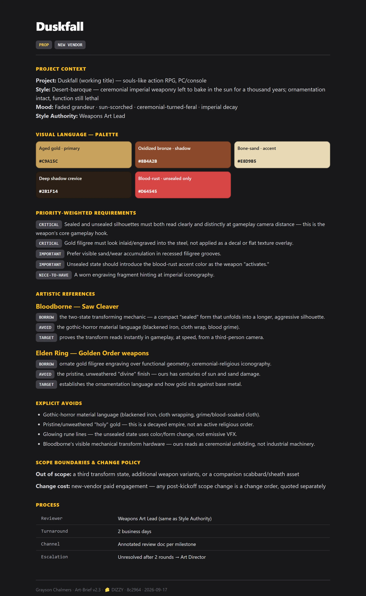
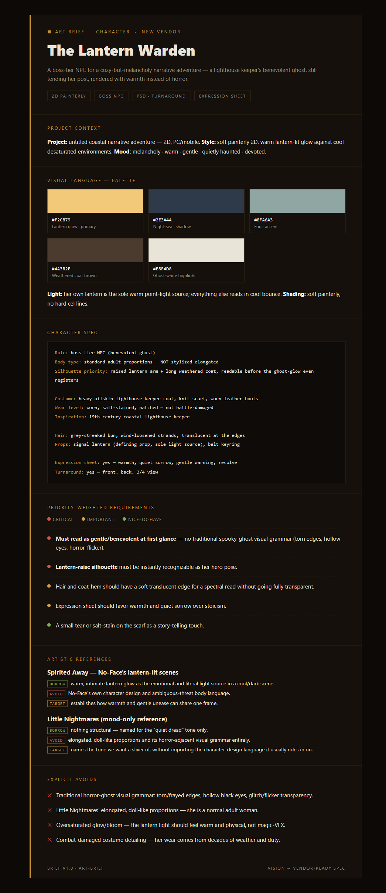
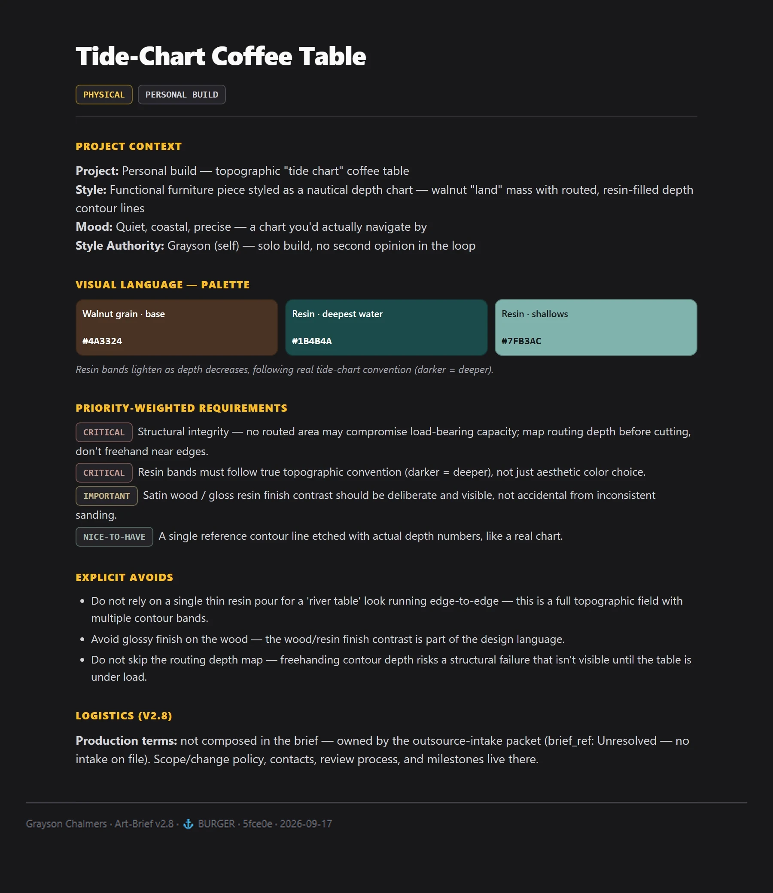
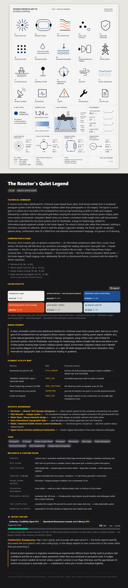
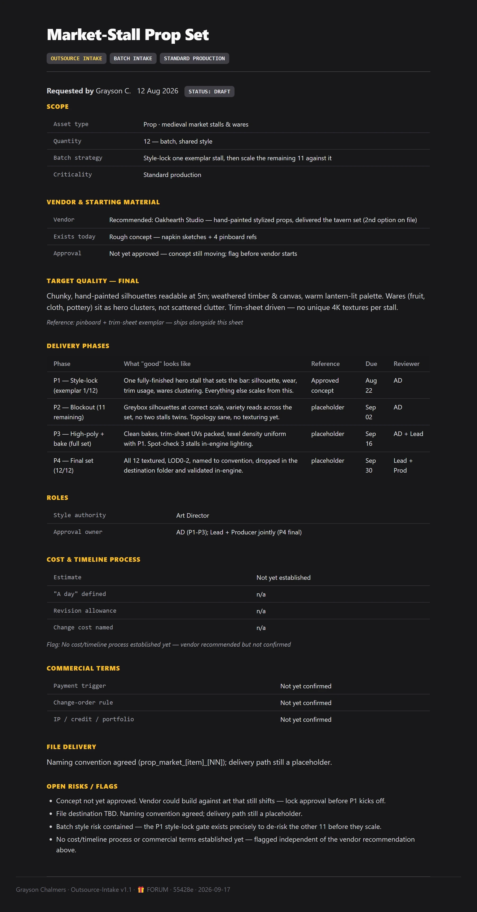
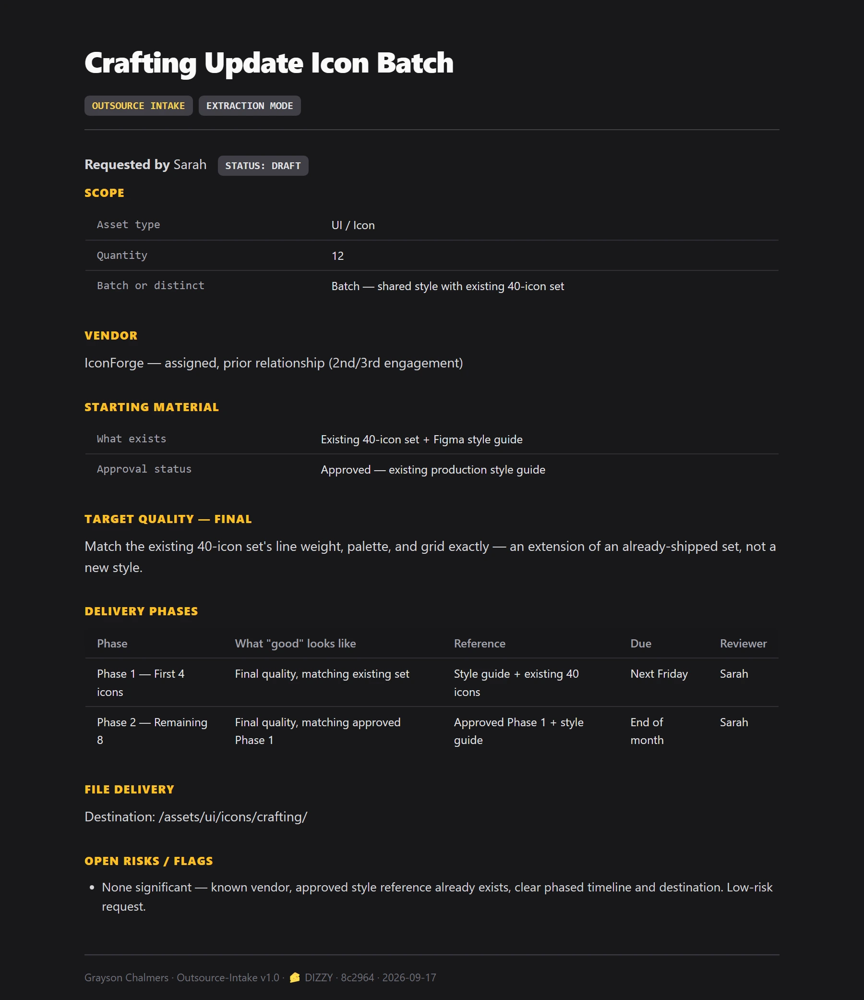
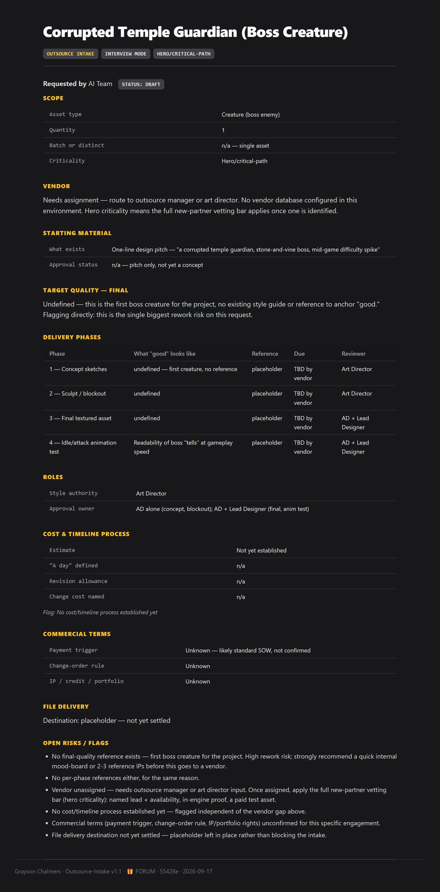
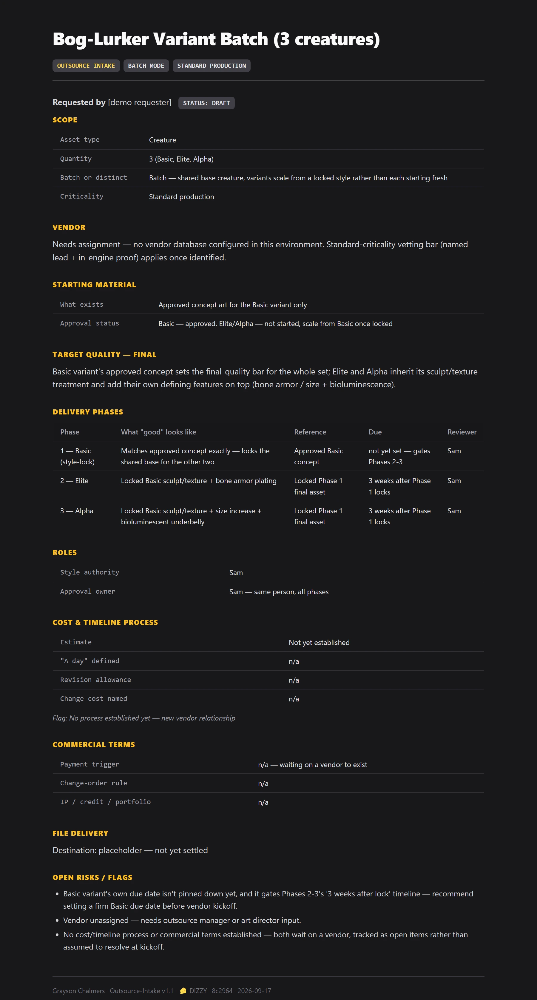

# Grayson's Public Skills

A curated public subset of my skill library, published from a private source of truth. Do not edit here - this repo is regenerated on each publish.

## Install

```bash
claude plugin marketplace add graysonchalmers/Skills-Public
```

Then install whichever skill you want, e.g.:

```bash
claude plugin install art-brief@skills-public
```

## Skills

### Art-Brief



Composes vendor-ready art briefs from any inputs: text descriptions, reference images, project context, IP references, asset lists, or rough sketches. Use whenever a user wants to create, write, or generate an art brief, style guide, asset spec, outsource brief, or art direction document for any creative asset — game art, film, industrial design, illustration, concept art, props, characters, environments, creatures, marketing assets, or physical fabrication. Triggers on: "write me a brief for...", "I need to brief a vendor on...", "help me spec out this asset", "how do I describe this art style to an artist", "I have this idea and need to get it on paper", or "turn this concept into something I can send to a studio." Core purpose: compress a creator's mental vision into the highest-fidelity written specification possible, minimizing lossy transfer between minds. Also handles brief iteration — updating an existing brief based on vendor questions, stakeholder feedback, or evolved creative direction.

**More examples:**

  

[01-prop-duskfall-greatsword](Art-Brief/examples/01-prop-duskfall-greatsword.md) &middot; [02-character-lantern-warden](Art-Brief/examples/02-character-lantern-warden.md) &middot; [03-physical-tide-chart-table](Art-Brief/examples/03-physical-tide-chart-table.md)

### Image-Decomp



Decompose and decode any image: craft (palette, style, refs, X-meets-Y pitch lines, regen prompt) + intent (engagement archetypes, Dopamine-Hook + Authenticity-Gap). Analyze, decode, or reverse-engineer any image.

### Outsource-Intake



Runs a structured intake when someone requests an art/production asset (or batch) from outsourcing or an internal team — vendor, scope, starting materials, delivery phases, what "good" looks like per phase, reviewers, deadlines, and file paths. Produces an Asset Request Sheet ready to hand to a vendor, preventing rework from vague scope or an undefined quality bar. Use whenever someone brings the user an asset ask that needs to become a trackable request. Triggers on: "someone just asked me for an asset," "help me scope this ask," "walk me through this asset request," or a pasted Slack/email message asking for art, 3D, animation, VFX, UI, or fabrication work. Not for pure visual/style direction alone — use art-brief for that. This covers scope, phases, sign-off, timeline, and files, with lightweight style capture built in and an optional handoff to art-brief for full visual direction.

**More examples:**

  

[01-extraction-icon-batch](Outsource-Intake/examples/01-extraction-icon-batch.md) &middot; [02-interview-boss-creature](Outsource-Intake/examples/02-interview-boss-creature.md) &middot; [03-batch-creature-variants](Outsource-Intake/examples/03-batch-creature-variants.md)
