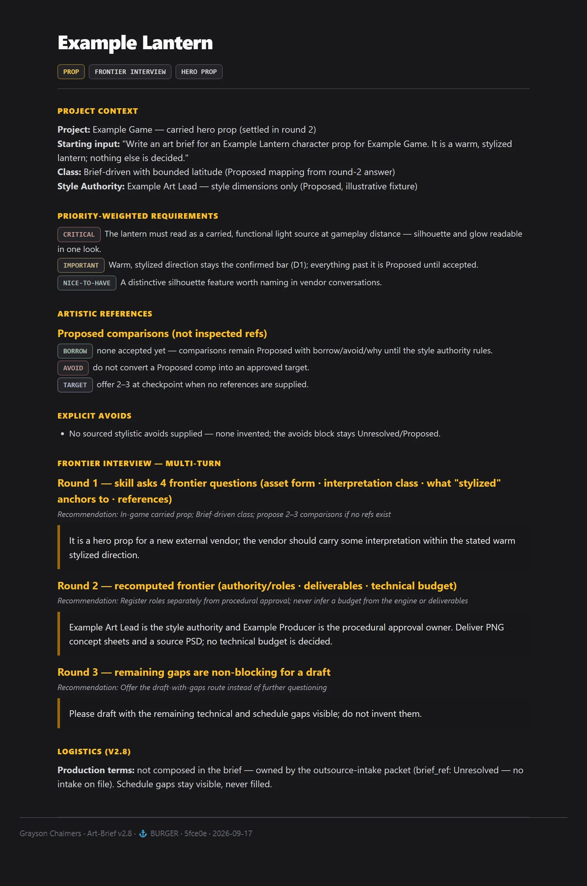
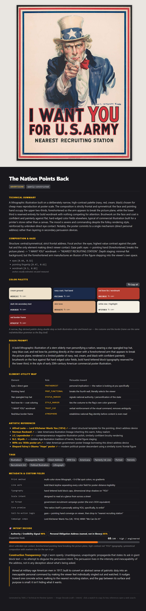
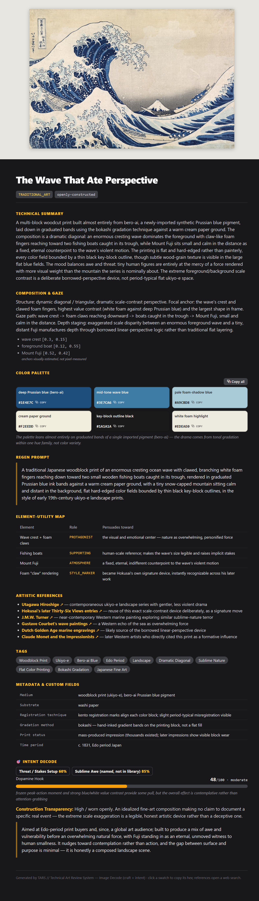
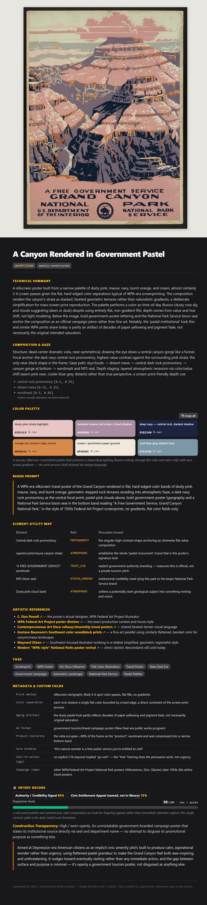

# Grayson's Public Skills

Hi, I'm Grayson — 22 years running art outsourcing in games (Blizzard, Epic, Riot), and I build tools for myself and my team along the way. These are a few Claude Code skills from my own library that I found genuinely useful, made public in case they're useful to you too.

[graysonchalmers.com](https://graysonchalmers.com) · [LinkedIn](https://www.linkedin.com/in/graysonchalmers)

This is a curated public subset of a private source of truth — don't edit here, it's regenerated on each publish.

## Install

```bash
claude plugin marketplace add graysonchalmers/Skills-Public
```

Then install whichever skill you want, e.g.:

```bash
claude plugin install art-brief@skills-public
```

## Skills at a Glance

| Skill | Preview | Mission |
|---|---|---|
| **[Art-Brief](#art-brief)** | <a href="#art-brief"></a> | Composes the art bible for a creative asset — project context, visual language, technical spec, artistic references, priority-weighted requirements, and explicit avoids — from any... |
| **[Image-Decomp](#image-decomp)** | <a href="#image-decomp"></a> | Decompose and decode any image: craft (palette, style, refs, X-meets-Y pitch lines, regen prompt) + intent (engagement archetypes, Dopamine-Hook + Authenticity-Gap). |
| **[Outsource-Intake](#outsource-intake)** | <a href="#outsource-intake"></a> | Runs a structured intake when someone requests an art/production asset (or batch) from outsourcing or an internal team — scope, starting materials, delivery phases, what "good" lo... |

## Skills

### Art-Brief


Composes the art bible for a creative asset — project context, visual language, technical spec, artistic references, priority-weighted requirements, and explicit avoids — from any inputs: text descriptions, reference images, project context, IP references, asset lists, or rough sketches. Use whenever a user wants to create, write, or generate an art brief, style guide, asset spec, or art direction document for any creative asset — game art, film, industrial design, illustration, concept art, props, characters, environments, creatures, marketing assets, or physical fabrication. Triggers on: "write me a brief for...", "I need to brief a vendor on...", "help me spec out this asset", "how do I describe this art style to an artist", "I have this idea and need to get it on paper", or "turn this concept into something I can send to a studio." Core purpose: compress a creator's mental vision into the highest-fidelity written specification possible, minimizing lossy transfer between minds. Also handles brief iteration — updating an existing brief based on vendor questions, stakeholder feedback, or evolved creative direction. Scope boundary: this is the style-authority record. Production logistics — scope/change policy, contacts, review process, payment, milestones — are the delivery-authority record owned by **outsource-intake**, which consumes this brief by reference (`brief_ref`). This skill interviews only for creative alignment; outsource-intake interviews only for logistics.

#### Release notes — Art-Brief v2.8 / Outsource-Intake v1.6

##### What changed

**Role-boundary split: art bible vs. production.** Art-Brief is now the style-authority record — the art bible. Outsource-Intake is the delivery-authority record — scope/change policy, contacts, review process, commercial terms, milestones. The only coupling point is `brief_ref`: an intake packet consumes a brief by reference and never re-derives its art decisions; a brief that will drive a vendor engagement carries an open pointer (`brief_ref [ID] / Unresolved — no intake on file`) instead of logistics blocks.

**Logistics blocks left the brief.** Scope Boundaries & Change Policy, Contact Directory, Process, and Delivery & Milestones are no longer composed in an Art-Brief output. The Vendor Brief now carries a one-line logistics pointer; style avoids stay strictly stylistic, with work-scope rulings routed to intake.

**Creative-only interview.** Art-Brief's adaptive frontier questions resolve creative ambiguity only — reference conflicts, stylization floors, mood, interpretation latitude. It never interviews for reviewer names, channels, dates, payment, or change-order terms; volunteered facts are registered and passed through to intake.

**Change-order disposition deferred.** Art-Brief Mode B still classifies an edit (clarification / correction / included revision / new scope) but routes the commercial disposition to the intake packet's change-order rule instead of deciding it.

**Consuming a brief by reference (Outsource-Intake v1.6).** When an art-brief document exists, intake cites it as `brief_ref`, copies its decisions with provenance, never re-interviews them, flags "no brief on file" as a visible gap with a handoff offer, and routes conflicts against the brief back to its register instead of resolving them in the sheet.

**Source-linked rendering contract.** Both skills load a compact source/decision register before any checkpoint, recap, or assembly. Every condensed claim renders from a register atom with an inline ID and source key — not from a freehand summary of another output block.

**Separate reviewer and approver roles.** A named reviewer no longer populates procedural approval ownership. Style authority is scoped to the dimensions it actually rules; a proportions ruling does not ban rendering styles or require new sign-off gates.

**Missing ≠ nonexistent.** "Not supplied" stays "not supplied" — it never becomes "none exist" or "out of scope" without an explicit source. Requested dates stay requested, not agreed. A file drop is not a feedback channel.

**Optional, not mandatory.** Priority weights, milestone structures, and phase templates are offered as Proposed when useful, not forced into every output. An empty plan is Unresolved, not a requirement to invent M1–M4.

**Mini-sheet is a separate route.** Internal, single-asset, low-stakes asks get a compact ≤250-word core with at most five questions and one readiness line — no Stage ceremony, no phase template. The full six-role contact appendix sits outside the cap.

**Adaptive frontier interview.** Normal mode now registers supplied facts first, asks only 2–4 consequential questions from the current decision frontier, recomputes after each answer, and records a source-linked interview trace. Sparse requests get deeper questioning; dense requests stay quiet. Debug remains immediate and question-free.

**Semantic example chips.** Public cards keep dark-neutral surfaces while using restrained muted accents for Borrow/Avoid/Target and Critical/Important/Nice-to-have. Color communicates role or priority, not approval status.

**Debug is request-scoped.** Debug previews use placeholder tokens or clearly synthetic Example values. The override ends with the request; the next request returns to normal gates. Synthetic fixture values stay Proposed, never Confirmed or Ready.

##### Behavioral evidence

11/11 synthetic cases passed independent review against the specific failures from the prior run. See `scratch/art-intake-release/run5-REVIEW.md` for the per-case evidence table. This is one synthetic run per case, not a measured reliability rate.

**Examples:**

   

<details>
<summary>Read the full write-up — 01-prop-duskfall-greatsword</summary>

# Example 1 — PROP brief, new vendor, IP borrow/avoid

**Synthetic user input:**

> Need an art brief for a legendary greatsword called "Duskfall" for our
> souls-like action RPG. Think Bloodborne's Saw Cleaver for the transforming
> mechanic, and Elden Ring's Golden Order weapons for the ornate gold
> filigree — but our world isn't gothic horror or high fantasy, it's a
> sun-scorched dying empire, more desert-baroque. Going to a vendor we
> haven't worked with before. Need it delivered as FBX + 4K Substance
> textures for Unreal 5.

---

## 📋 BRIEF ASSUMPTIONS — confirmed for this demo

⚠️ **Asset Type:** PROP (weapon)
⚠️ **Project Context:** Souls-like action RPG, "sun-scorched dying empire" —
desert-baroque aesthetic, not the more common gothic-horror or high-fantasy
default for this genre
⚠️ **Target Audience:** New vendor, first brief — precise, no assumptions,
full style bible references included
⚠️ **Style Authority:** Weapons Art Lead — final word on whether the
transform reads and the filigree language lands; same person as the named
reviewer in Process below
⚠️ **Art Style Direction:** Ornate, sun-bleached ceremonial weaponry that
still reads as lethal — baroque gold filigree over sand-worn steel, not
polished/pristine
⚠️ **Delivery Format:** FBX + 4K Substance Painter textures, Unreal 5 PBR
pipeline

🔴 **Priority Flags:** The transforming silhouette (sealed vs. unsealed
state) must read as two distinct, equally strong shapes — this is the
weapon's core gameplay hook, not just a visual flourish.

🚩 **Concerns:** None — references don't conflict; both borrowed qualities
target mechanism and ornamentation, not palette, so the desert-baroque
palette direction sits cleanly on top of both.

---

## OUTPUT BLOCK 1 — 📄 Art Direction Document

### 🎯 Project Context
- **Project:** *Duskfall* (working title) — souls-like action RPG, PC/console
- **Art style:** Desert-baroque — ceremonial imperial weaponry left to bake
  in the sun for a thousand years; ornamentation intact, function still lethal
- **Tone/mood:** Faded grandeur, sun-scorched, ceremonial-turned-feral,
  imperial decay

### 🎨 Visual Language
- **Palette:** `#C9A15C` (aged gold primary), `#8B4A2B` (oxidized bronze
  shadow), `#E8D9B5` (bone-sand accent), `#2B1F14` (deep shadow crevice),
  `#D64545` (blood-rust highlight, unsealed state only)
- **Lighting:** Hard overhead desert sun, high-contrast rim light on gold
  edges
- **Edge style:** Ornate filigree edges sharp and clean where gold survives;
  base steel edges pitted and irregular
- **Texture density:** High — this is a hero prop, hold up in close-up
  inventory/inspection views
- **Shading model:** PBR, metal/rough workflow

### 📐 Technical Spec
- **Deliverable:** FBX (game-ready + high-poly bake source), 4K Substance
  Painter texture set (Base Color, Normal, ORM)
- **Polycount target:** ≤18K tris game-res; unlimited high-poly for baking
- **LOD:** LOD0 (hero) + LOD1 (mid-range) required; LOD2 optional

### 🧭 Artistic References

```
IP: Bloodborne — Saw Cleaver
✅ Borrow: the two-state transforming mechanic — a compact "sealed" form
   that unfolds into a longer, more aggressive silhouette
❌ Avoid: the gothic-horror material language (blackened iron, cloth wrap,
   blood grime) — this is not our world's palette or material story
🎯 Target: proves the transform reads instantly in gameplay, at speed,
   from a third-person camera

IP: Elden Ring — Golden Order weapons (e.g. Marika's / Radagon's weapons)
✅ Borrow: ornate gold filigree engraving over the blade and guard,
   ceremonial-religious iconography worked into functional geometry
❌ Avoid: the pristine, unweathered "divine" finish — ours has centuries of
   sun and sand damage, not immaculate holy shine
🎯 Target: establishes the ornamentation language and how gold sits against
   base metal
```

### 🔴🟡🟢 Priority-Weighted Requirements
- 🔴 Sealed and unsealed silhouettes must both read clearly and distinctly
  at gameplay camera distance
- 🔴 Gold filigree must look inlaid/engraved into the steel, not applied as
  a decal or flat texture overlay
- 🟡 Prefer visible sand/wear accumulation in recessed filigree grooves
- 🟡 Unsealed state should introduce the blood-rust accent color as the
  weapon "activates"
- 🟢 A worn engraving fragment hinting at imperial iconography would be a
  nice easter-egg detail, not required for approval

### ⛔ Explicit Avoids
- Do not use gothic-horror material language (blackened iron, cloth
  wrapping, grime/blood-soaked cloth)
- Avoid pristine/unweathered "holy" gold — this is a decayed empire, not an
  active religious order
- No glowing rune lines — the unsealed state uses color/form change, not
  emissive VFX (VFX team owns any particle/glow pass separately)
- Do not reference Bloodborne's transform *mechanism aesthetic* (the visible
  gear/mechanism at the fold point) — ours should look more like a ceremonial
  unfolding, not industrial machinery

### 🚧 Logistics — owned by outsource-intake (v2.8)

Scope/change policy, contact directory, review process, and milestones are
not composed in the brief. Register the user-supplied facts and pass them
through: Weapons Art Lead (full approval authority), 2-business-day
turnaround, annotated review doc per milestone, escalation to the Art
Director after two unresolved rounds; out of scope — a third transform
state, extra weapon variants, a companion scabbard, all change-order
territory. `brief_ref: Unresolved — no intake on file.`

---

## OUTPUT BLOCK 2 — 📬 Vendor Brief

*Duskfall* is a souls-like action RPG set in a sun-scorched dying empire —
desert-baroque, not gothic-horror or high-fantasy. This brief covers
"Duskfall," a legendary transforming greatsword and one of our hero props.

**Key requirements:**
- 🔴 Two-state transforming weapon — sealed and unsealed forms must each
  read as a strong, distinct silhouette at gameplay camera distance
- 🔴 Gold filigree engraved/inlaid into base steel, not decaled on top
- 🟡 Sand/wear buildup in recessed engraving grooves
- 🟡 Blood-rust accent color (`#D64545`) introduced only in the unsealed state

**References:**
```
IP: Bloodborne — Saw Cleaver
✅ Borrow: two-state transforming mechanic, compact → aggressive silhouette
❌ Avoid: gothic-horror material language (blackened iron, cloth, grime)

IP: Elden Ring — Golden Order weapons
✅ Borrow: ornate gold filigree over functional geometry
❌ Avoid: pristine/unweathered "divine" finish
```

**Explicit avoids:** gothic-horror materials, pristine holy gold, glowing
rune VFX, visible mechanical transform hardware.

**Production terms (v2.8):** not composed in the brief — owned by the
outsource-intake packet (`brief_ref: Unresolved — no intake on file`).
Scope/change policy, contacts, review process, and milestones live there.

**Deliverables:** FBX (game-res ≤18K tris + high-poly bake source), 4K
Substance Painter texture set (Base Color/Normal/ORM), LOD0 + LOD1.

Please reach out if you have questions or need clarification on any point.

---

## OUTPUT BLOCK 3 — 🤖 Generation Prompts

**Midjourney:**
> ornate ceremonial greatsword, desert-baroque design, engraved gold
> filigree inlaid into sun-bleached pitted steel, imperial iconography
> worn by centuries of sand, hard overhead desert sunlight, high contrast
> rim light on gold edges, weapon concept art, game asset render
> --ar 2:3 --s 250 --v 6

**DALL-E / GPT-Image:**
> A weapon concept art render of an ornate, sun-scorched ceremonial
> greatsword called "Duskfall," blending the ornate gold filigree
> engraving of Elden Ring's Golden Order weapons with the compact,
> two-state transforming silhouette of Bloodborne's Saw Cleaver — but
> reimagined for a desert-baroque dying empire rather than gothic horror
> or high fantasy. Sun-bleached pitted steel base, gold inlay worn by sand
> and time, hard directional desert light, PBR game-asset quality render
> on a neutral studio background.

**Stable Diffusion:**
> ornate greatsword, desert-baroque, gold filigree inlay, sun-bleached
> steel, sand-worn engraving, imperial iconography, transforming weapon,
> pitted metal texture, hard rim lighting, PBR render, weapon concept art,
> game asset
> Negative: gothic, blackened iron, cloth wrap, blood grime, glowing runes,
> pristine polish, fantasy generic

</details>

<details>
<summary>Read the full write-up — 02-character-lantern-warden</summary>

# Example 2 — CHARACTER brief, new vendor, full milestone structure

**Synthetic user input:**

> Write a character brief for "The Lantern Warden" — a boss-tier NPC in our
> cozy-but-melancholy narrative adventure game. She's a lighthouse keeper
> who died protecting her coastal village and now wanders as a benevolent
> ghost, still doing her job. Visual inspiration: Studio Ghibli's warmth
> (Spirited Away's No-Face lantern glow) crossed with the quiet dread of
> Little Nightmares' proportions. Going to a new outsource vendor, need a
> full turnaround sheet + expression sheet, PSD + PNG deliverables for a
> 2D game.

---

## 📋 BRIEF ASSUMPTIONS — confirmed for this demo

⚠️ **Asset Type:** CHARACTER (ghost NPC, boss-tier)
⚠️ **Project Context:** Cozy-but-melancholy 2D narrative adventure —
tonal blend of warmth and quiet grief rather than horror
⚠️ **Target Audience:** New vendor, first brief — full turnaround +
expression sheet required since this is a new relationship
⚠️ **Style Authority:** Narrative/Character Art Director — final word on
whether she reads as gentle rather than unsettling
⚠️ **Art Style Direction:** Soft painterly 2D, warm lantern-lit glow
against cool desaturated surroundings — inviting silhouette, melancholy
detailing
⚠️ **Delivery Format:** PSD (layered) + PNG exports, front/back/3-quarter
turnaround, full expression sheet

🔴 **Priority Flags:** She must read as gentle/benevolent at first glance
despite being a ghost — the game leans on the player *not* feeling
threatened, so no traditional "spooky ghost" visual grammar (torn edges,
translucent horror-flicker, hollow eyes).

🚩 **Concerns:** Little Nightmares' proportions read as unsettling by
design (elongated, doll-like) — flagged as a target-quality-only
reference, explicitly excluded from the Borrow list to avoid pulling in
its horror-adjacent visual grammar by osmosis.

---

## OUTPUT BLOCK 1 — 📄 Art Direction Document

### 🎯 Project Context
- **Project:** untitled coastal narrative adventure — 2D, PC/mobile
- **Art style:** soft painterly 2D — warm lantern-lit glow, cool desaturated
  environments, gentle brushwork over hard cel lines
- **Tone/mood:** melancholy · warm · gentle · quietly haunted · devoted

### 🎨 Visual Language
- **Palette:** `#F2C879` (lantern glow primary), `#2E3A4A` (night-sea
  shadow), `#8FA6A3` (fog accent), `#4A3B2E` (weathered coat brown),
  `#E8E4D8` (translucent ghost-white highlight)
- **Lighting:** warm point-light from her own lantern as the sole
  light source in most scenes; everything else reads in cool bounce
- **Shading model:** soft painterly, no hard cel lines
- **Texture density:** low-to-moderate — this is 2D game art, not
  render-detail heavy

### CHARACTER SPEC
```
Role: boss-tier NPC (benevolent ghost)
Gender presentation & age range: woman, late 40s-50s at time of death
Body type & proportions: standard adult proportions, NOT stylized-elongated
  (explicitly not Little-Nightmares-doll-like — see Explicit Avoids)
Silhouette priority: the raised lantern arm + long weathered coat silhouette
  must read instantly as "keeper," even before the ghost-glow registers

Costume / Armor:
- Primary material: heavy oilskin lighthouse-keeper coat
- Secondary material: knit scarf, worn leather boots
- Color blocking: coat carries the weathered-brown, scarf carries a single
  warm accent, lantern is the only saturated light-source color
- Wear & damage level: worn, salt-stained, patched — not battle-damaged
- Cultural / historical inspiration: 19th-century coastal lighthouse keeper

Hair / Head:
- Style: simple bun, wind-loosened strands
- Key color: grey-streaked dark brown, rendered slightly translucent at
  the edges to read as spectral without full transparency

Accessories & Props:
- Signal lantern (her defining prop and sole light source)
- A keyring at her belt (implies duty/routine, not combat)

Animation considerations: hero rig, idle/walk/lantern-raise "beckon" gesture
Expression sheet needed: yes — warmth, quiet sorrow, gentle warning, resolve
Turnaround needed: yes — front, back, 3/4 view
```

### 🧭 Artistic References
```
IP: Spirited Away — No-Face's lantern-lit night scenes
✅ Borrow: warm, intimate lantern glow as the emotional and literal light
   source in an otherwise cool/dark scene
❌ Avoid: No-Face's own character design and ambiguous-threat body language
🎯 Target: establishes how warmth and gentle unease can share one frame

IP: Little Nightmares (proportions only, target-quality reference)
✅ Borrow: nothing — reference is for the "quiet dread" mood target only
❌ Avoid: elongated, doll-like proportions and its horror-adjacent visual
   grammar entirely — she must read as a normal, huggable adult woman
🎯 Target: names the *tone* we want a sliver of, without importing the
   character-design language that tone usually rides in on
```

### 🔴🟡🟢 Priority-Weighted Requirements
- 🔴 Must read as gentle/benevolent at first glance — no traditional
  "spooky ghost" visual grammar (torn edges, hollow eyes, horror-flicker)
- 🔴 Lantern-raise silhouette must be instantly recognizable as her hero pose
- 🟡 Hair and coat-hem should have a soft translucent edge treatment to
  read as spectral without going fully transparent
- 🟡 Expression sheet should favor warmth and quiet sorrow over stoicism
- 🟢 A small tear or salt-stain detail on the scarf as a story-telling touch

### ⛔ Explicit Avoids
- Do not use traditional horror-ghost visual grammar: torn/frayed edges,
  hollow black eyes, glitch/flicker transparency
- Do not adopt Little Nightmares' elongated, doll-like body proportions —
  she is a normal adult woman, full stop
- Avoid oversaturated glow/bloom — the lantern light should feel warm and
  physical, not like a magic-VFX light source
- No combat-damaged costume detailing — her wear comes from decades of
  weather and duty, not battle

### 🚧 Logistics — owned by outsource-intake (v2.8)

Scope/change policy, contact directory, review process, and milestones are
not composed in the brief. Register the user-supplied facts and pass them
through: Character Art Director (same person as Style Authority — recorded
without flagging the name match), 2-business-day turnaround, annotated
review doc, escalation to the Creative Director after two unresolved
rounds; out of scope — extra costume variants, a second expression-sheet
style, a non-ghost design pass (change-order territory).
`brief_ref: Unresolved — no intake on file.`

---

## OUTPUT BLOCK 2 — 📬 Vendor Brief

This brief covers "The Lantern Warden," a boss-tier NPC for an untitled
coastal narrative adventure (2D, PC/mobile) — a lighthouse keeper's ghost
who still tends her post, rendered with warmth rather than horror.

**Key requirements:**
- 🔴 Must read as gentle/benevolent, not a traditional spooky ghost — no
  torn edges, hollow eyes, or horror-flicker transparency
- 🔴 Lantern-raise pose is her hero silhouette and must be instantly
  recognizable
- 🟡 Soft translucent edge treatment on hair/coat-hem for a spectral read
  without full transparency
- 🟡 Expression sheet should lean warm/quiet-sorrow, not stoic

**References:**
```
IP: Spirited Away — No-Face's lantern-lit scenes
✅ Borrow: warm intimate lantern glow against a cool/dark scene
❌ Avoid: No-Face's own design and ambiguous-threat body language

IP: Little Nightmares (mood-only reference)
✅ Borrow: nothing structural — named for "quiet dread" tone only
❌ Avoid: elongated doll-like proportions entirely
```

**Explicit avoids:** horror-ghost visual grammar, doll-like proportions,
oversaturated magic-glow bloom, combat-damaged costuming.

**Production terms (v2.8):** not composed in the brief — owned by the
outsource-intake packet (`brief_ref: Unresolved — no intake on file`).
Scope/change policy, contacts, review process, and milestones live there.

**Deliverables:** PSD (layered) + PNG, front/back/3-quarter turnaround,
full expression sheet (warmth, quiet sorrow, gentle warning, resolve).

Please reach out if you have questions or need clarification on any point.

---

## OUTPUT BLOCK 3 — 🤖 Generation Prompts

**Midjourney:**
> gentle ghost lighthouse keeper, warm lantern glow, weathered oilskin
> coat, soft translucent hair and coat-hem edges, painterly 2D game
> character art, melancholy but benevolent expression, cool night-sea
> background, warm point-light from lantern as sole light source
> --ar 2:3 --s 300 --v 6

**DALL-E / GPT-Image:**
> A soft, painterly 2D game character portrait of a benevolent ghost
> lighthouse keeper, a woman in her late 40s wearing a weathered oilskin
> coat and knit scarf, raising a glowing signal lantern that is the only
> warm light source in an otherwise cool, desaturated coastal night scene.
> Her hair and coat-hem have a subtle translucent quality suggesting she
> is a spirit, but her expression and proportions are warm and normal, not
> frightening. Style inspired by Studio Ghibli's lantern-lit warmth,
> explicitly not horror-ghost imagery.

**Stable Diffusion:**
> ghost lighthouse keeper, warm lantern glow, oilskin coat, knit scarf,
> translucent hair edges, painterly 2D character art, melancholy warm
> expression, cool desaturated night background, gentle silhouette
> Negative: horror ghost, hollow eyes, torn fabric, glitch transparency,
> elongated proportions, doll-like, scary, combat damage

</details>

<details>
<summary>Read the full write-up — 03-physical-tide-chart-table</summary>

# Example 3 — PHYSICAL/fabrication brief, internal team tone

**Synthetic user input:**

> I want to build a coffee table that looks like a topographic tide chart —
> walnut, with the "water" areas as a poured blue-green resin inlay showing
> depth contour lines routed into the wood before pouring. About 48"x28"
> tabletop, needs to actually hold weight (it's a real table, not just
> decorative). This is for my own house, not a client. I'll be building it
> myself in my garage shop.

---

## 📋 BRIEF ASSUMPTIONS — confirmed for this demo

⚠️ **Asset Type:** PHYSICAL (furniture / fabrication)
⚠️ **Project Context:** Personal build, functional coffee table
⚠️ **Target Audience:** Internal/self — direct, technical tone, can
reference maker-community shorthand (CNC, epoxy, etc.) without over-explaining
⚠️ **Art Style Direction:** Topographic tide chart aesthetic — routed
contour lines filled with tinted resin to read as depth bands, walnut as
the "land"
⚠️ **Delivery Format:** n/a (this is a personal build spec, not a vendor
deliverable) — brief instead functions as the maker's own build reference
⚠️ **Style Authority:** Grayson (self) — solo personal build, no second
opinion in the loop

🔴 **Priority Flags:** Structural load-bearing integrity is non-negotiable
— this is a real table, not a display piece, so the resin inlay pour depth
and wood removal depth must not compromise structural strength at the
tabletop's thinnest points.

🚩 **Concerns:** Deep contour routing near the tabletop edges risks
thinning the wood below a safe structural minimum — flagged as a
design constraint requiring a routing depth map before cutting, not
freehanded.

---

## OUTPUT BLOCK 1 — 📄 Art Direction Document

### 🎯 Project Context
- **Project:** personal build — topographic "tide chart" coffee table
- **Style:** functional furniture piece styled as a nautical depth chart —
  walnut "land" mass with routed, resin-filled depth contour lines
- **Tone/mood:** quiet, coastal, precise — a chart you'd actually navigate by

### 🎨 Visual Language
- **Palette:** natural walnut grain (warm brown, `#4A3324` base), resin
  bands from `#1B4B4A` (deepest water) lightening to `#7FB3AC` (shallows)
  as depth decreases, following real tide-chart convention (darker = deeper)
- **Surface treatment:** wood sanded/oiled to a satin (not glossy) finish;
  resin poured flush and polished to a higher gloss for contrast
- **Shading model:** n/a (physical object — finish sheen carries this role)

### PHYSICAL SPEC
```
Object type: coffee table (functional, load-bearing)
Fabrication method: CNC or hand-routed wood + poured epoxy resin inlay

Dimensions (L x W x H): 48in x 28in x 16in (standard coffee table height)
Weight target or constraint: table must support 50+ lbs distributed load
  without flex at center span
Material(s): walnut slab or edge-glued walnut panel (tabletop), hardwood
  legs/base (walnut or complementary species), 2-part clear/tinted epoxy
  resin for the water bands
Finish: hard-wax oil or satin polyurethane on wood; resin polished to gloss

Structural requirements: freestanding, load-bearing tabletop — routing
  depth must be mapped BEFORE cutting to guarantee minimum wood thickness
  (recommend no less than 40% of slab thickness remaining at any routed point)
Joinery / assembly method: breadboard ends or a torsion-box substrate
  recommended to counter warping from asymmetric resin pour
Tolerance: ±1/16in on contour routing for clean resin pour lines

Reference scale: 1:1 (functional full-size table)
Texture / surface treatment: satin wood finish, gloss resin finish (deliberate
  contrast between the two surface types)
Color: walnut natural grain; resin bands dark-to-light teal by depth,
  darkest at the deepest/widest contour, following real tide-chart shading

Environment: indoor, living-room use
```

### 🔴🟡🟢 Priority-Weighted Requirements
- 🔴 Structural integrity — no routed area may compromise load-bearing
  capacity; map routing depth before cutting, don't freehand near edges
- 🔴 Resin bands must follow true topographic convention (darker = deeper),
  not just aesthetic color choice — this is what sells the "chart" read
- 🟡 Satin wood / gloss resin finish contrast should be deliberate and
  visible, not accidental from inconsistent sanding
- 🟢 A single reference contour line etched with actual depth numbers
  (like a real chart) would be a nice authenticity detail

### ⛔ Explicit Avoids
- Do not rely on a single thin resin pour for a "river table" look running
  edge-to-edge — this is a full topographic field with multiple contour
  bands, not one channel
- Avoid glossy finish on the wood — the wood/resin finish contrast is part
  of the design language, not an oversight to fix later
- Do not skip the routing depth map — freehanding contour depth risks a
  structural failure that isn't visible until the table is under load

### 🚧 Logistics — owned by outsource-intake (v2.8)

Personal build with no partner and no intake packet: no scope/change policy,
contacts, review process, or milestones to compose. The real boundary is
sequencing — the routing depth map is locked before any cut — and that lives
in the Materials & Process Note below, which replaces the Vendor Brief and
Generation Prompts blocks for physical/fabrication builds per the skill's
routing rule. `brief_ref: Unresolved — no intake on file.`

---

## OUTPUT BLOCK 2 — 📬 Vendor Brief

*(Not applicable — this is a personal build. Skipping to the Materials &
Process Note, which replaces both the Vendor Brief and Generation Prompts
blocks for physical/fabrication builds per the skill's own routing rule.)*

---

## OUTPUT BLOCK 3 — 🧰 Materials & Process Note

**Sequence:**
1. Source/mill a walnut slab or edge-glue panel to 48"x28", flatten and
   surface both faces.
2. **Map the routing depth BEFORE cutting** — model the contour bands
   digitally (even a simple layered sketch) and confirm minimum remaining
   wood thickness at every routed point clears 40% of slab thickness.
3. Rout contour bands (CNC preferred for repeatable depth control; hand
   router with a depth-stop jig is workable if you're confident in the
   depth map).
4. Dam the perimeter of each routed band, tint 2-part epoxy in graduated
   teal shades (darkest for the deepest/widest band), pour in stages from
   deepest to shallowest to avoid bleed between colors.
5. Cure fully per resin manufacturer's schedule before sanding.
6. Flatten/sand the whole surface (wood + cured resin together) to bring
   both to one true plane, working up through grits.
7. Finish: hard-wax oil or satin polyurethane on the wood, then polish the
   resin bands separately to a higher gloss for the material contrast.
8. Attach to a torsion-box substrate or breadboard-end base to resist
   warping from the asymmetric resin pour before final assembly with legs.

**Tools/materials to have on hand:** CNC router or plunge router + edge
guide/depth-stop jig, dam material (silicone or tape) for the resin pour,
graduated epoxy tints, random-orbit sander through progressive grits,
digital scale for resin mixing ratios.

</details>

<details>
<summary>Read the full write-up — 04-frontier-interview-lantern</summary>

# Example 4 — FRONTIER INTERVIEW (multi-turn Q&A → brief), hero prop

**Synthetic user input (turn 1):**

> Write an art brief for an Example Lantern character prop for Example
> Game. It is a warm, stylized lantern; nothing else is decided.

---

## Round 1 — registered, then 4 frontier questions

**Register:** `D1` Example Lantern, warm/stylized — **Confirmed** · `D2`
"nothing else is decided" is itself a captured fact — **Confirmed** · `D3`
PROP vs figurine — **Proposed** · everything else **Unresolved**.

**Q1. What is the asset, physically/functionally?** Carried in-game prop, or
physical figurine? *(Recommendation: in-game carried prop — changes the
schema and every downstream question.)*
**Q2. How much interpretation should the partner carry?** Self-governing,
Brief-driven, or Volume-with-QA? *(Recommendation: Brief-driven — with only
"warm, stylized" decided, a fixed-target brief is the safest default.)*
**Q3. What does "stylized" anchor to here?** Chunky rounded vs. hand-painted
flat vs. clean geometric — and is "warm" palette, lighting read, or both?
*(Highest-leverage ambiguity: sets silhouette, shading, and palette at once.)*
**Q4. Any references in mind?** *(If none: 2–3 Proposed comparisons at the
checkpoint.)*

> **A1 (user):** It is a hero prop for a new external vendor; the vendor
> should carry some interpretation within the stated warm stylized direction.

## Round 2 — frontier recomputed

**Q5. Style authority vs. approval owner, and deliverables?**
*(Register roles separately; never infer a technical budget from the
deliverable list.)*

> **A2 (user):** Example Art Lead is the style authority and Example
> Producer is the procedural approval owner. Deliver PNG concept sheets and
> a source PSD; no technical budget is decided.

## Round 3 — gaps are non-blocking

> **A3 (user):** Please draft with the remaining technical and schedule
> gaps visible; do not invent them.

---

## OUTPUT BLOCK 1 — 📄 Art Direction Document (excerpt)

### 🎯 Project Context
- **Project:** Example Game — carried hero prop (settled in round 2)
- **Confirmed bar:** warm, stylized lantern — nothing beyond it is promoted
- **Class:** Brief-driven with bounded latitude *(Proposed mapping)*

### 🔴🟡🟢 Priority-Weighted Requirements
- 🔴 **Critical** — The lantern must read as a carried, functional light
  source at gameplay distance; silhouette and glow readable in one look.
- 🟡 **Important** — Warm, stylized stays the confirmed bar; everything
  past it is Proposed until the style authority accepts it.
- 🟢 **Nice-to-have** — A distinctive silhouette feature worth naming in
  vendor conversations.

### ⛔ Explicit Avoids
- No sourced stylistic avoids supplied — none invented; the avoids block
  stays Unresolved/Proposed.

### Open Decisions (visible, not filled)
Stylization anchor, genre/setting/mood beyond "warm stylized," technical
budget, schedule/milestones — all **Unresolved**, owners unknown where not
supplied.

### 🚧 Logistics pointer
`Logistics: owned by outsource-intake (brief_ref: Unresolved — no intake on
file).` Scope/change policy, contacts, review process, and milestones are
composed in the intake packet, not in the brief.

---

## What this example demonstrates

- **Adaptive multi-turn interview:** questions come from the current
  decision frontier only — 4 in round 1 (sparse input), fewer thereafter,
  stop when gaps are non-blocking or draft permission is explicit.
- **Creative-only frontier:** no reviewer/channel/date/payment questions —
  roles volunteered by the user are registered and passed through to
  outsource-intake.
- **Role-boundary split (v2.8):** the brief is the style-authority record;
  logistics blocks render as an open pointer, never as invented terms.
- **Nothing promoted:** a general "draft it" authorizes drafting, not
  blanket promotion of every assumption.

</details>

### Image-Decomp


Decompose and decode any image: craft (palette, style, refs, X-meets-Y pitch lines, regen prompt) + intent (engagement archetypes, Dopamine-Hook + Authenticity-Gap). Analyze, decode, or reverse-engineer any image.

**Examples:**

  

<details>
<summary>Read the full write-up — 01-advertising-uncle-sam</summary>

# Example 1 — ADVERTISING (openly-constructed), historical propaganda poster

**Source image:** *"I Want You for U.S. Army"*, James Montgomery Flagg, 1917.
Public domain (US government-commissioned WWI recruitment poster). Sourced
from [Wikimedia Commons](https://commons.wikimedia.org/wiki/File:I_Want_You_for_U.S._Army_poster_(1917).jpg).

---

## Visual Report

# The Nation Points Back

**Advertising — openly-constructed** (illustrated propaganda poster; no
claim to depict a real moment)

## ⚡ Pitch Lines

> **Lord Kitchener Wants You's direct-address command pose** + **a
> Norman Rockwell magazine cover's warm, folksy illustrative polish** — the
> British stare gets Americanized into something homier and more
> approachable, but no less inescapable.
> — *mainstream* — the frontal pointing figure staring straight down the
> lens is the exact device Alfred Leete used in 1914; the soft brushwork,
> warm cream ground, and rosy-cheeked rendering read as Golden Age American
> magazine illustration rather than stark British wartime graphic design.

> **A carnival barker's crowd-cut** + **the American flag's own color
> grammar** — the whole image works like a barker singling one person out
> of a crowd, dressed head-to-toe in the literal colors of the state.
> — *medium* — the tight crop and foreshortened pointing arm pull the
> viewer forward like a barker's beckon; the top-hat band, bow tie, and
> coat are rendered in the exact red/white/blue the flag uses, not
> incidental color choice.

> **A Byzantine icon's frontal, eyes-on-you address** + **a circus
> ringmaster's theatrical costuming**
> — *deep-cut* — the strict frontal symmetry and unbroken direct gaze
> occupy the same compositional role an icon's gaze plays in devotional
> painting; the top hat, tailcoat, and bow tie are unmistakably theatrical
> showman's dress, not military uniform, which is part of why the figure
> reads as a personification rather than a soldier.

## Technical Summary

A lithographic illustration built on a deliberately narrow, high-contrast
palette — navy, red, cream, and black — chosen for cheap mass reproduction
at poster scale, not painterly range. The composition is strictly frontal
and symmetrical: Uncle Sam's face and pointing hand occupy the upper
two-thirds, foreshortened so the arm appears to break the picture plane
and reach into the viewer's space, while the lower third is reserved
entirely for bold wordmark with no competing visual elements. Brushwork on
the face and coat is confident and painterly against flat, hard-edged
color fields elsewhere, a combination typical of commercial illustration
built for a printer's stone rather than a canvas. The mood is severe and
commanding rather than warm, despite the folksy rendering style,
reinforced by the unbroken direct eye contact. Notably, the poster commits
completely to a single mechanism (direct personal address) rather than
layering in secondary persuasion devices — a clarity of intent that later
government propaganda repeatedly imitated.

## Composition & Gaze

- **Structure:** central/symmetrical, strict frontal address
- **Focal anchor:** the eyes — highest value contrast against the pale hat,
  and the only element making direct contact with the viewer
- **Gaze path:** eyes → pointing hand (foreshortened toward camera, breaks
  the picture plane) → "I WANT YOU" wordmark → "NEAREST RECRUITING STATION"
- **Depth staging:** minimal — flat illustrative background, but the
  foreshortened arm manufactures an illusion of the figure stepping out of
  the frame into the viewer's own space
- **Anchors (estimated):** eyes `[0.44, 0.32]` · pointing fingertip
  `[0.47, 0.62]` · wordmark `[0.50, 0.83]`

## Artistic References

Alfred Leete's *Lord Kitchener Wants You* (1914) — direct structural
template for the pointing, direct-address device; Norman Rockwell — later
Americana illustration lineage inheriting this warm, folksy realism;
J.C. Leyendecker — contemporaneous magazine-illustration polish, similarly
confident brushy rendering of fabric and light; N.C. Wyeth — Golden Age
illustration tradition of heroic, frontal figure staging; WPA-era 1930s
government poster art — later American lineage that borrows this
direct-address device wholesale; Shepard Fairey's Obama "Hope" poster — a
modern political-poster descendant using a similarly iconic, endlessly
reproducible frontal figure.

## Generated Prompt

> A bold lithographic illustration of a stern elderly man personifying a
> nation, wearing a star-spangled top hat, navy blue coat, and red bow
> tie, pointing directly at the viewer with a foreshortened arm that
> appears to break the picture plane, rendered in a limited palette of
> navy, red, cream, and black with confident painterly brushwork on the
> face against flat hard-edged color fields, bold hand-lettered block
> typography reserved for the lower third, in the style of early
> 20th-century American commercial poster illustration.

## Tags

`Illustration` `Propaganda Poster` `Direct Address` `WWI Era` `Americana`
`Painterly Ink Line` `Portrait` `Patriotic` `Recruitment Art`
`Political Illustration` `Lithograph`

## Color Palette

`#EDE2CC` cream ground · `#1C2A4A` navy coat/hat band · `#B23B2E` red bow
tie/wordmark · `#1B1B2E` dark ink secondary text · `#D9A87E` skin tone ·
`#F5F0E4` white star/highlight · `#7A1F1F` red border frame

## Element-Utility Map

| Element | Role | Persuades toward |
|---|---|---|
| Eyes / direct gaze | PROTAGONIST | personal implication — the nation is looking at *you specifically* |
| Pointing hand | PROP_FUNCTIONAL | breaks the fourth wall, literally selects the viewer |
| Star-spangled top hat | STATUS_MARKER | signals national authority / personification of the state |
| Red bow tie + coat coloring | STYLE_MARKER | ties the costume to the flag's own color grammar |
| "I WANT YOU" wordmark | TRUST_CUE | verbal reinforcement of the visual command, removes ambiguity |
| Red/blue border frame | ATMOSPHERE | establishes national-flag identity at the frame level before content is read |

## Custom Fields

| Field | Value |
|---|---|
| Print method | multi-color stone lithograph, ~5-6 flat spot colors, no gradients |
| Line work | bold black keyline separating every color field for poster-distance legibility |
| Typography | hand-lettered bold block caps, dimensional drop-shadow on "YOU" for emphasis |
| Scale intent | designed to read at a glance from across a street — maximal contrast, minimal detail |

## Metadata — Advertising / Campaign Key Visual

| Field | Value |
|---|---|
| Ad format | government recruitment campaign poster (the era's OOH equivalent) |
| Product hierarchy | face + pointing hand dominate upper 2/3; wordmark occupies lower third, non-competing |
| Brand cues | flag palette applied to both costume and border frame; top hat = personified national authority |
| Core promise | "the nation itself is personally asking YOU, specifically, to enlist" |
| Copy space | lower third reserved entirely for wordmark, no clutter |
| Call-to-action logic | gaze + pointing hand converge on viewer, then drop to "nearest recruiting station" — a literal next step |
| Aspiration target | military-age American men, WWI era |
| Campaign comps | *Lord Kitchener Wants You* (UK, 1914) — direct template; WWII "We Can Do It!" — same government-poster direct-address lineage |

## 🎯 Intent Decode

**Archetypes:**
- **Authority / Credibility Signal** — 0.9 — the top hat's "national
  personification" costuming, severe formal expression, and
  government-issued context all function as the ultimate third-party
  authority appeal
- **Personal Obligation Address** *(named — not in the current library)* —
  0.85 — direct second-person visual and verbal address ("YOU") with no
  mediating third party, engineered so refusal reads as a personal moral
  failure rather than a neutral choice; signals are the unbroken eye
  contact, the fourth-wall-breaking pointing hand, and the singular
  second-person wordmark

**Dopamine Hook Score:** 68 / 100 — **high / engineered**. Drivers: direct
unbroken eye contact, the foreshortened pointing hand physically breaking
the picture plane toward the viewer, high-contrast red "YOU" typography,
and a symmetrical composition that gives the eye nowhere else to go.

**Construction Transparency:** high / worn openly. This is unambiguous,
unapologetic propaganda that states its ask in giant block text — there is
no attempt to disguise the persuasive intent as something more innocent.
The maximal transparency is itself the design choice; the persuasion lives
entirely in the *intensity and inescapability* of the direct address, not
in any deception about what's being asked.

**Viewer effect:** aimed at military-age American men in 1917; built to
convert an abstract sense of patriotic duty into an inescapable, personal
command by making the viewer feel individually singled out and watched.
It nudges toward one concrete action — walking to the nearest recruiting
station — and the honest gap between its surface and its purpose is
small: it isn't hiding what it wants. Its power is rhetorical intensity,
not concealment.

</details>

<details>
<summary>Read the full write-up — 02-traditionalart-great-wave</summary>

# Example 2 — TRADITIONAL_ART (openly-constructed), historical fine art print

**Source image:** *The Great Wave off Kanagawa*, Katsushika Hokusai, c. 1831
(from *Thirty-Six Views of Mount Fuji*). Public domain. Sourced from
[Wikimedia Commons](https://commons.wikimedia.org/wiki/File:Katsushika_Hokusai_The_Great_Wave_off_Kanagawa_1830.jpg).

---

## Visual Report

# The Wave That Ate Perspective

**Traditional Art — openly-constructed** (woodblock print; an idealized
composed scene, not reportage)

## ⚡ Pitch Lines

> **A Hokusai woodblock's controlled clawed linelwork** + **a Baroque
> history painting's dramatic diagonal thrust**
> — *mainstream* — the wave's crest rises on a steep diagonal that drives
> the eye down into the trough exactly like a Baroque battle scene's
> compositional logic, but rendered in flat, hard-edged printed color
> instead of painterly chiaroscuro.

> **Ukiyo-e's flat color-block printing** + **a borrowed Western
> linear-perspective trick lifted from Dutch trade prints**
> — *medium* — Hokusai studied imported Dutch engravings; the exaggerated
> size gap between the towering foreground wave and a tiny, distant Mount
> Fuji uses a linear-perspective scale device that traditional flat ukiyo-e
> spatial layering doesn't normally reach for.

> **A fractal coastline's self-similar branching foam** + **a Noh mask's
> frozen dramatic held-tension**
> — *deep-cut* — the foam "claws" at the wave's crest branch in a
> self-similar pattern later cited by mathematicians discussing natural
> fractal forms, while the print catches the wave at its single most
> suspended, about-to-break instant — the same frozen-tension quality a
> Noh performer holds in a climactic pose.

## Technical Summary

A multi-block woodcut print built almost entirely from *bero-ai* — a
newly-imported synthetic Prussian blue pigment — laid down in graduated
bands using the *bokashi* gradation technique, against a warm cream paper
ground. The composition is a dramatic diagonal: an enormous cresting wave
dominates the foreground with claw-like foam fingers reaching down toward
two fishing boats caught in its trough, while Mount Fuji sits small and
calm in the distance, functioning as a fixed, eternal counterpoint to the
wave's violent motion. The printing technique is flat and hard-edged
rather than painterly — every color field is bounded by a thin black
key-block outline printed to unify the composition — though subtle
wood-grain texture is visible in the large flat blue fields. The mood
balances awe and threat: the tiny human figures are entirely at the mercy
of a force rendered with more visual weight and detail than the mountain
the series is nominally about. Notably, the extreme foreground/background
scale contrast is a deliberate perspective device, not a period-typical
flat ukiyo-e space.

## Composition & Gaze

- **Structure:** dynamic diagonal / triangular, dramatic scale-contrast
  perspective
- **Focal anchor:** the wave's crest and its clawed foam fingers — highest
  value contrast (white foam against deep Prussian blue) and the largest
  shape in the frame
- **Gaze path:** wave crest → foam claws reaching downward → boats caught
  in the trough → Mount Fuji, small and calm in the far background
- **Depth staging:** exaggerated scale disparity between an enormous
  foreground wave and a tiny, distant Fuji manufactures dramatic depth
  through borrowed linear-perspective logic rather than traditional flat
  layering
- **Anchors (estimated):** wave crest `[0.30, 0.15]` · foreground boat
  `[0.12, 0.55]` · Mount Fuji `[0.52, 0.42]`

## Artistic References

Utagawa Hiroshige — contemporaneous ukiyo-e landscape series with a
gentler, less violent sense of drama; Hokusai's own later prints in the
same *Thirty-Six Views* series — reuse of this exact scale-contrast device
deliberately, as a signature move; J.M.W. Turner — near-contemporary
Western marine painting exploring similar sublime-nature terror; Gustave
Courbet's later wave paintings — a Western echo of the same "the sea as
overwhelming force" subject; Dutch Golden Age marine engravings — the
likely source of the borrowed linear-perspective device; Claude Monet and
the Impressionists — later Western artists who directly cited this print
as a formative influence on their own compositions.

## Generated Prompt

> A traditional Japanese woodblock print of an enormous cresting ocean
> wave with clawed, branching white foam fingers reaching down toward two
> small wooden fishing boats caught in its trough, rendered in graduated
> Prussian blue ink bands against a warm cream paper ground, with a tiny
> snow-capped mountain sitting calm and distant in the background, flat
> hard-edged color fields bounded by thin black key-block outlines, in
> the style of early 19th-century ukiyo-e landscape prints.

## Tags

`Woodblock Print` `Ukiyo-e` `Bero-ai Blue` `Edo Period` `Landscape`
`Dramatic Diagonal` `Sublime Nature` `Flat Color Printing`
`Bokashi Gradation` `Japanese Fine Art`

## Color Palette

`#1E4E7C` deep Prussian blue (bero-ai) · `#3E7CA6` mid-tone wave blue ·
`#A9CBD8` pale foam-shadow blue · `#F2EEDD` cream paper ground ·
`#1A1A1A` key-block outline black · `#EDEAE0` white foam highlight

## Element-Utility Map

| Element | Role | Persuades toward |
|---|---|---|
| Wave crest + foam claws | PROTAGONIST | the visual and emotional center — nature as overwhelming, personified force |
| Fishing boats | SUPPORTING | human-scale reference; makes the wave's size legible and raises implicit stakes |
| Mount Fuji | ATMOSPHERE | a fixed, eternal, indifferent counterpoint to the wave's violent motion |
| Foam "claw" rendering | STYLE_MARKER | became Hokusai's own signature device, instantly recognizable across his later work |

## Custom Fields

| Field | Value |
|---|---|
| Registration technique | *kento* registration marks align each color block; slight period-typical misregistration is visible and expected |
| Pigment | *bero-ai* (imported Prussian blue) — new to Japan at the time, enabled the deep saturated blue impossible with prior natural pigments |
| Gradation method | *bokashi* — hand-inked gradient bands on the printing block, not a flat fill |
| Print status | mass-produced impression (thousands existed); later impressions show visible block wear |

## Metadata — Traditional Art

| Field | Value |
|---|---|
| Medium | woodblock print (ukiyo-e), *bero-ai* Prussian blue pigment |
| Substrate | washi paper |
| Texture | flat printed color with *bokashi* gradated blue bands; subtle wood-grain visible in large flat fields |
| Movement affinity | ukiyo-e "floating world" school, with borrowed Western linear-perspective influence via Dutch trade prints |
| Composition type | dynamic diagonal / triangular, dramatic scale-contrast perspective |
| Time period | c. 1831, Edo period Japan |
| Artist comps | Utagawa Hiroshige — contemporaneous, gentler drama; Hokusai's own later series entries — same device reused deliberately |

## 🎯 Intent Decode

**Archetypes:**
- **Threat / Stakes Setup** — 0.6 — looming environmental hazard, high
  value contrast, unresolved peril for the tiny boat crews caught beneath
  the wave's curl
- **Sublime Awe** *(named — not in the current library)* — 0.85 — a
  viewer-invited feeling of overwhelming scale and indifferent natural
  power; signals are the extreme size disparity between wave and Fuji, the
  frozen peak-of-power instant, and a low vantage point that puts the
  viewer at roughly boat-level looking up into the curl

**Dopamine Hook Score:** 48 / 100 — **moderate**. Drivers: a frozen
peak-action moment and strong blue/white value contrast provide some
immediate visual pull, but the overall effect is contemplative rather than
attention-grabbing — this is built for sustained looking, not a glance.

**Construction Transparency:** high / worn openly. This is an
unambiguous, idealized fine-art composition — a landscape print making no
claim to document a specific real event. It doesn't disguise its
artifice; the extreme scale exaggeration is itself a legible, honest
artistic device rather than a deceptive one.

**Viewer effect:** aimed at Edo-period print buyers and, since, a global
art audience; built to produce a mix of awe and vulnerability before an
overwhelming natural force, with Fuji standing in as an eternal, unmoved
witness to human smallness. It nudges toward contemplation rather than
any action, and the gap between its surface and purpose is minimal — it
is honestly a composed landscape scene, not a persuasive artifact
pretending to be something else.

</details>

<details>
<summary>Read the full write-up — 03-graphicdesign-grand-canyon-wpa</summary>

# Example 3 — ADVERTISING (openly-constructed), 1930s government graphic design

**Source image:** *Grand Canyon National Park, a free government service*,
designed by C. Don Powell for the WPA Federal Art Project / National Park
Service, c. 1938. Public domain (US government work). Sourced from
[Wikimedia Commons](https://commons.wikimedia.org/wiki/File:Grand_Canyon_National_Park,_a_free_government_service_LCCN2007676131.jpg).

---

## Visual Report

# A Canyon Rendered in Government Pastel

**Advertising — openly-constructed** (silkscreen campaign poster; no claim
to depict a specific real moment)

## ⚡ Pitch Lines

> **A National Park Service travel poster's flat, saturated color-block
> printing** + **Art Deco's geometric stepped-terrace styling**
> — *mainstream* — the canyon's rock strata are rendered as clean, stacked
> geometric bands rather than naturalistic erosion, the same reductive,
> faceted treatment Art Deco applied to skyscrapers and machine forms.

> **A WPA-era silkscreen's limited spot-color registration** + **a
> topographic relief map's layered elevation bands**
> — *medium* — each rock stratum is a single flat color separated by a
> hard edge exactly like a screenprint's color-separation constraint, and
> the whole canyon reads like a topo map's elevation banding turned into
> landscape art.

> **Japanese ukiyo-e's flat multi-block color printing** + **a New Deal
> public-works poster's didactic government branding**
> — *deep-cut* — the flat hard-edged color fields and total absence of
> gradients recall the exact printmaking logic of ukiyo-e woodblock work,
> while the explicit "A FREE GOVERNMENT SERVICE" wordmark and NPS bison
> seal brand it unmistakably as New Deal public messaging rather than fine
> art.

## Technical Summary

A silkscreen poster built from a narrow palette of dusty pink, mauve,
navy, burnt orange, and cream, almost certainly 5-6 screen passes given
the flat, hard-edged color separations typical of WPA-era screenprinting.
The composition renders the canyon's strata as stacked, faceted geometric
terraces rather than naturalistic gradients, a deliberate simplification
for mass screen-print reproduction. The palette performs a
color-as-time-of-day illusion (dusty rose sky and clouds suggesting dawn
or dusk) despite using entirely flat, non-gradient fills — depth comes
from value and hue shift, not light modeling. Below the image, bold
government-poster lettering and the National Park Service bison seal
anchor the composition as an official campaign piece rather than fine art.
Notably, the "pastel institutional" look this and similar WPA prints share
today is partly an artifact of decades of paper yellowing and pigment
fade, not necessarily the original intended saturation.

## Composition & Gaze

- **Structure:** dead-center dramatic vista, near-symmetrical, drawing the
  eye down a central canyon gorge like a funnel
- **Focal anchor:** the dark navy central rock promontory — highest value
  contrast against the surrounding pink strata, the only near-black shape
  in the frame
- **Gaze path:** sky/clouds → distant mesa → central dark rock promontory
  → canyon gorge at bottom → wordmark and NPS seal
- **Depth staging:** layered atmospheric recession via color/value shift
  (warm pink near, cooler blue-grey distant) rather than true perspective
  — a screen-print-friendly depth cue
- **Anchors (estimated):** central promontory `[0.50, 0.55]` · distant
  mesa `[0.55, 0.25]` · wordmark `[0.50, 0.85]`

## Artistic References

C. Don Powell — the poster's actual designer, WPA Federal Art Project
illustrator; the WPA Federal Art Project poster division broadly — the
exact production context and house style; contemporaneous Art Deco
railway/steamship travel posters — shared faceted-terrain visual language;
Gustave Baumann's Southwest color woodblock prints — a fine-art parallel
using similarly flattened, banded color for canyon and mesa landscapes;
Maynard Dixon — Southwest-focused illustrator working in a related
simplified, geometric regionalist style; the modern "WPA-style" National
Parks poster revival — direct stylistic descendants still sold today.

## Generated Prompt

> A WPA-era silkscreen travel poster of the Grand Canyon rendered in flat,
> hard-edged color bands of dusty pink, mauve, navy, and burnt orange,
> geometric stepped rock terraces receding into atmospheric haze, a dark
> navy rock promontory as the central focal point, pastel pink clouds
> above, bold government-poster typography and a National Park Service
> bison seal in the bottom band reading "A Free Government Service, Grand
> Canyon National Park," in the style of 1930s Federal Art Project
> screenprints, no gradients, flat color fields only.

## Tags

`Screenprint` `WPA Poster` `Art Deco Influence` `Flat Color Illustration`
`Travel Poster` `New Deal Era` `Government Campaign`
`Geometric Landscape` `National Park Service` `Pastel Palette`

## Color Palette

`#E8C6C6` dusty pink (strata highlight) · `#A98DA0` lavender-mauve (mid
strata / cloud shadow) · `#1B2340` deep navy (central rock, darkest
shadow) · `#D98A4A` orange-tan (stratum edge accent) · `#F0E9DC`
cream/parchment (paper ground) · `#7C97A6` cool blue-grey (distant haze)

## Element-Utility Map

| Element | Role | Persuades toward |
|---|---|---|
| Central dark rock promontory | PROTAGONIST | the singular high-contrast shape anchoring an otherwise flat-value composition |
| Layered pink/mauve canyon strata | ATMOSPHERE | establishes the whole "pastel monument" mood that is this poster's signature look |
| "A FREE GOVERNMENT SERVICE" wordmark | TRUST_CUE | explicit government-authority branding — reassures this is official, not a private tourism pitch |
| NPS bison seal | STATUS_MARKER | institutional credibility mark tying this park to the larger National Park Service brand |
| Dusty pink cloud bank | ATMOSPHERE | softens a potentially stark geological subject into something inviting and scenic |

## Custom Fields

| Field | Value |
|---|---|
| Print method | silkscreen (serigraph), likely 5-6 spot-color passes, flat fills, no gradients |
| Color separation | each rock stratum a single flat color bounded by a hard edge, a direct constraint of the screen-print process |
| Aging artifact | the dusty "pastel" look partly reflects decades of paper yellowing and pigment fade, not necessarily original saturation |
| Typography | bold geometric sans government-poster lettering, centered, tightly kerned |

## Metadata — Advertising / Campaign Key Visual

| Field | Value |
|---|---|
| Ad format | government tourism/travel campaign poster (New Deal-era public works program) |
| Product hierarchy | the vista occupies ~80% of the frame as the "product"; wordmark and seal compressed into a narrow bottom band |
| Brand cues | NPS bison seal + "U.S. Department of the Interior" wordmark, explicit federal authorship |
| Core promise | "this natural wonder is a free public service you're entitled to visit" |
| Copy space | bottom ~15% reserved entirely for wordmark and seal, zero copy over the image |
| Call-to-action logic | no explicit CTA beyond implied "go visit" — the "free" framing does the persuasive work, not urgency |
| Aspiration target | Depression-era American public — reassures budget-conscious citizens this is an already-paid-for civic amenity |
| Campaign comps | other WPA/Federal Art Project National Park posters (Yellowstone, Zion, Glacier) — same campaign system; later 1950s-60s airline travel posters — commercial descendant of the flat-color destination-poster genre |

## 🎯 Intent Decode

**Archetypes:**
- **Authority / Credibility Signal** — 0.85 — the NPS seal, "U.S.
  Department of the Interior" wordmark, and "a free government service"
  framing all explicitly invoke government authority as the trust
  mechanism
- **Civic Entitlement Appeal** *(named — not in the current library)* —
  0.75 — repeated "free"/"government service" framing reframes visiting
  nature as a citizen's already-paid-for right rather than a luxury
  purchase, a distinctly New Deal-era persuasion move that differs from
  typical commercial tourism advertising's aspirational-wealth framing

**Dopamine Hook Score:** 30 / 100 — **low / quiet**. Drivers: a soft
pastel palette and symmetrical, calm composition are built for lingering
appeal rather than immediate attention capture; the single contrast spike
is the dark central rock formation.

**Construction Transparency:** high / worn openly. An unmistakable
government-branded campaign poster that states its institutional source
directly via seal and department name — there's no attempt to disguise
its promotional purpose as something else.

**Viewer effect:** aimed at Depression-era American citizens as an
implicit civic-amenity pitch; built to produce calm, aspirational wonder
rather than urgency, using flattened pastel grandeur to make the Grand
Canyon feel both awe-inspiring and unthreatening. It nudges toward
eventually visiting rather than any immediate action, and the gap between
surface and purpose is minimal — it's openly a government tourism poster,
not disguised as anything else.

</details>

### Outsource-Intake


Runs a structured intake when someone requests an art/production asset (or batch) from outsourcing or an internal team — scope, starting materials, delivery phases, what "good" looks like per phase, reviewers, deadlines, and file paths. Produces an Asset Request Sheet ready to hand to a vendor, preventing rework from vague scope or an undefined quality bar. This is the delivery-authority record; it consumes an art-brief document by reference (`brief_ref`) rather than re-deriving art decisions. Use whenever someone brings the user an asset ask that needs to become a trackable request. Triggers on: "someone just asked me for an asset," "help me scope this ask," "walk me through this asset request," or a pasted Slack/email message asking for art, 3D, animation, VFX, UI, or fabrication work. Not for pure visual/style direction alone — use art-brief for that. This covers scope, phases, sign-off, timeline, and files, with lightweight style capture built in and an optional handoff to art-brief for full visual direction.

#### Release notes — Outsource-Intake v1.6

##### What changed

**Role-boundary split: art bible vs. production.** Outsource-Intake is the delivery-authority record — scope/change policy, contacts, review process, commercial terms, milestones. Art-Brief is the style-authority record (the art bible). The only coupling point is `brief_ref`: when an art-brief document exists for the ask, intake cites it, reuses its decisions with provenance, and never re-derives, re-interviews, or silently overrides them. "No brief on file" is a visible gap with a handoff offer, not an invitation to improvise art direction.

**Brief of record in the sheet.** The recap and full Asset Request Sheet gain an "Art brief of record" line (`brief_ref` + version/date, or Unresolved). Conflicts against the brief route back to its register instead of resolving in the sheet.

**Source-linked rendering contract.** The intake loads a compact source/decision register before the first extraction summary, recap, or sheet assembly. Every condensed claim renders from a register atom with an inline ID and source key.

**Separate reviewer and approver.** A named reviewer does not establish procedural approval authority. Style authority is recorded separately from the approval owner, even when the same person holds both. File drop destination is not a feedback channel.

**Missing ≠ nonexistent.** "Not supplied" stays "not supplied" — it never becomes "none exist" or "out of scope" without an explicit source. A prior call establishes contact, not prior engagement or vetting. An existing partner claim from the user is attributed input; an assistant inference of a relationship is Proposed.

**Optional, not mandatory.** Phase templates are offered as Proposed when useful, not silently applied. An empty process is Unresolved, not a requirement to invent gates. Criticality inferred from context is Proposed, not a settled priority.

**Mini-sheet is a separate route.** Internal, single-asset, low-stakes asks get a compact ≤250-word core with at most five questions total and one readiness line — no Stage A/B/C ceremony, no phase template. The full six-role contact appendix and compact source register sit outside the cap.

**Adaptive frontier interview.** Normal mode now registers supplied facts first, asks only 2–4 consequential questions from the current decision frontier, recomputes after each answer, and records a source-linked interview trace. Sparse requests get deeper questioning; dense requests stay quiet. Debug remains immediate and question-free. The mini route remains capped at five total questions.

**Semantic example chips.** Public cards keep dark-neutral surfaces while using restrained muted accents for Borrow/Avoid/Target and Critical/Important/Nice-to-have. Color communicates role or priority, not approval status.

**Debug is request-scoped.** Debug previews use placeholder tokens or clearly synthetic Example values. The override ends with the request; the next request returns to normal gates. Synthetic fixture values stay Proposed, never Confirmed or Ready.

##### Behavioral evidence

11/11 synthetic cases passed independent review against the specific failures from the prior run. See `scratch/art-intake-release/run5-REVIEW.md` for the per-case evidence table. This is one synthetic run per case, not a measured reliability rate.

**Examples:**

  

<details>
<summary>Read the full write-up — 01-extraction-icon-batch</summary>

# Example 1 — Extraction mode (dense forwarded request)

**Synthetic user input:**

> hey can you help me intake this — Sarah just sent me this in Slack:
> "need 12 inventory icons for the crafting update, same style as our
> existing 40 icons (style guide is in Figma, link below), vendor is
> IconForge (we've used them twice before), first batch of 4 needed by
> next Friday for review, I'll sign off on those before the rest,
> full set due end of month, delivery to /assets/ui/icons/crafting/"

---

## 🔍 Parsed automatically from the message

- **Asset type:** UI (icon batch)
- **Criticality:** background/low-stakes — extending an already-shipped
  icon set, not a hero asset
- **Quantity:** 12, batch (shared style, not distinct assets)
- **Vendor:** IconForge — named, trusted (used twice before)
- **Starting material:** existing 40-icon set + Figma style guide — this
  **satisfies** the "final quality reference" requirement already
- **Delivery phases (implied):** first-4 review batch → remaining 8
- **Timeline:** first 4 by next Friday, full set end of month
- **File path:** `/assets/ui/icons/crafting/`

Got it — sounds like this is a 12-icon batch matching your existing style
guide, IconForge again, phased 4-then-8. A couple more things I need before
I can finalize the sheet:

## 📋 Gaps — only what's missing

1. **Reviewer** — who signs off on the first-4 batch, Sarah or someone else?
2. **Per-phase reference** — the Figma style guide covers final quality; is
   there also a reference for what "good" looks like at a rougher pass
   (e.g. line-art only), or should the first-4 batch just be judged against
   final quality directly since these are simple icons?
3. **Cost/timeline process** — with IconForge on their third engagement, is
   there already a standing rate/turnaround understanding, or does this
   need a fresh check?

*(For this demo, assuming: Sarah reviews both phases as both style
authority and approval owner — same person, low-stakes batch; no separate
rough-pass reference needed; and yes, a standing arrangement from the prior
two engagements already covers day definition and revision allowance, so
no new cost/timeline process needed here.)*

---

## 📋 QUICK RECAP — confirm before finalizing

```
Asset: 12 UI icons (crafting update), batch — shared style
Criticality: background/low-stakes
Vendor: IconForge (assigned, prior relationship)
Starting material: existing 40-icon set + Figma style guide (approved,
  satisfies final-quality reference — no need to re-request)
Phases: Phase 1 (4 icons, review) -> Phase 2 (remaining 8, final)
Due: Phase 1 - next Friday | Full set - end of month
Style authority / Approval owner: Sarah (both roles, same person)
Cost/timeline process: in place — standing arrangement from prior engagements
Commercial terms: covered by existing vendor relationship, not re-litigated

🔶 Flags: none — style reference already exists and is approved, vendor
  is known and vetted from two prior engagements, timeline and destination
  are both clear.
```

---

## OUTPUT — 📋 Asset Request Sheet

# 📋 Asset Request — Crafting Update Icon Batch (12 icons)

**Requested by:** Sarah  |  **Date:** [demo date]  |  **Status:** Draft

## Scope
- Asset type(s): UI / Icon
- Quantity, and what counts as one: 12 individual icons
- Batch (shared style) or distinct assets: Batch — shared style with
  existing 40-icon set
- Criticality: background/low-stakes

## Vendor
- IconForge — assigned, prior relationship (2nd/3rd engagement)
- New partner? No — third engagement, no vetting bar to apply

## Starting Material
- What exists: existing 40-icon set + Figma style guide
- Approval status: approved (existing production style guide)
- Files: Figma style guide — [link placeholder 📎]

## Target Quality — Final
- Quick read: Match the existing 40-icon set's line weight, palette, and
  grid exactly — these 12 are an extension of an already-shipped set, not
  a new style.
- Full interpretation: n/a — style guide + existing shipped icons already
  fully define the target; no additional interpretation needed
- Reference images: existing 40-icon set + Figma style guide 📎

## Delivery Phases
| Phase | What "good" looks like here | Reference | Due | Reviewer |
|---|---|---|---|---|
| Phase 1 — First 4 icons | Final quality, matching existing set | Figma style guide + existing 40 icons | Next Friday | Sarah |
| Phase 2 — Remaining 8 icons | Final quality, matching approved Phase 1 icons | Approved Phase 1 icons + style guide | End of month | Sarah |

## Roles
- Style authority (final word on the look): Sarah
- Approval owner (can say yes procedurally): Sarah — same as above

## Cost & Timeline Process
- Estimate exists: yes — standing arrangement from prior engagements
- "A day/week" defined: yes (established in prior engagements)
- Revision allowance stated with the price: yes
- Cost of a change named before there is one: yes
- Flag: none

## Commercial Terms (lightweight check, not a contract)
- Payment trigger agreed: yes — covered by existing vendor relationship
- Change-order rule agreed: yes
- IP / credit / portfolio rights understood: yes

## File Delivery
- Destination: `/assets/ui/icons/crafting/`
- Naming convention: [not specified — 📎 confirm with vendor before delivery,
  likely matches existing icon naming pattern]

## Open Risks / Flags
- None significant — known vendor, approved style reference already exists,
  clear phased timeline and destination. Low-risk request.

</details>

<details>
<summary>Read the full write-up — 02-interview-boss-creature</summary>

# Example 2 — Interview mode (bare trigger, full Q&A)

**Synthetic user input:**

> Someone on the AI team just asked me for a boss creature. Help me intake it.

No details given — running the full question flow from scratch.

---

## Step 1 — Classify the Ask

**Q:** What's the asset — character, prop, environment, creature, VFX, UI,
key art, scene comp, or physical?
**A (synthetic):** Creature — a boss enemy.

**Q:** Single asset, or part of a batch?
**A:** Single asset.

**Q:** Criticality — hero/critical-path, standard, or background?
**A:** Hero — a boss on the critical path for the swamp biome milestone.
This calibrates how much rigor the rest of the intake and vendor vetting
gets: full weight, not the light-touch version.

## Step 2 — Core Intake Questions

**Q1 — Vendor:** Named vendor, or need a recommendation?
**A:** No vendor picked yet, need a recommendation.

*(No vendor database connected in this environment — flagging per Step 4's
degrade-gracefully rule rather than guessing.)*

**Q2 — Starting material:** What exists today — nothing, napkin sketch,
rough concept, polished concept, or fully approved concept?
**A:** Nothing yet — just a one-line pitch from design: "a corrupted temple
guardian, stone-and-vine boss, mid-game difficulty spike."

**Q3 — Reference for "good" (final):** Any example images, files, or style
guide showing the target quality for the finished asset?
**A:** No — this is the first boss in the game, no existing style guide for
creatures yet.

*(Flagging this directly: an undefined final target is the single biggest
cause of rework — worth being explicit about with the requester before this
goes anywhere.)*

**Q4 — Delivery phases:** What stages do you want to review before final?

Pulling the closest template — this is a creature, so offering the
standard concept → blockout → final pass structure rather than applying it
silently:

> Suggested phases: (1) Concept sketches, (2) Sculpt/blockout, (3) Final
> textured asset. Want to keep this, cut a stage, or add one (e.g. a
> separate rigging/animation-ready pass)?

**A:** Keep it, but add a 4th phase for a basic idle/attack animation test
before calling it done — this is a boss, animation readability matters.

**Q5 — Reference for "good" (per phase):** For each phase, is there an
example of what good looks like at that stage specifically?
**A:** No per-phase references either — first creature for this project.

**Q6 — Timeline:** Overall due date, and per-phase if phased?
**A:** Overall due in 6 weeks. No fixed per-phase dates yet — asking the
vendor to propose a schedule once assigned.

**Q7 — Cost/timeline reality check:** Is there a process for sanity-checking
whatever estimate comes back — a defined "day," a stated revision
allowance, a named change cost?
**A:** No — first boss for the project, no existing rate arrangement or
process to check against yet. Flagging as a gap. This is independent of
the vendor being unassigned — it would still be a gap even with a vendor
picked.

**Q8 — Commercial readiness:** Payment trigger, change-order rule, IP/credit
terms — agreed anywhere, even a standard studio SOW?
**A:** Unknown — likely covered by a standard studio SOW but not confirmed
for this specific engagement. Flagging lightly, not blocking on it.

**Q9 — Style authority and approval owner:** Who's the final word on the
look, and who can procedurally say yes — same person or different?
**A:** Style authority is the Art Director throughout. Approval owner is
the Art Director alone for concept and blockout, and the Art Director
*plus* Lead Designer jointly for final and the animation test — design
needs to confirm readability there, not just visual quality. Naming both
roles even though they overlap for most of the timeline, so it's on record
if a review ever splits.

**Q10 — File paths:** Where should this land?
**A:** Not settled yet — leaving a placeholder.

---

## 📋 QUICK RECAP — confirm before finalizing

```
Asset: 1 creature (boss, corrupted temple guardian)
Criticality: hero/critical-path
Vendor: needs recommendation — no database connected, route to outsource
  manager or art director; hero criticality means the full new-partner
  vetting bar applies once one's identified (named lead + availability,
  in-engine proof, a paid test asset before full commitment)
Starting material: one-line design pitch only, no sketch/concept
Phases: Concept -> Blockout -> Final texture -> Animation test (added by
  requester)
Due: 6 weeks overall, per-phase dates TBD by vendor
Style authority / Approval owner: AD (style, throughout) | AD alone
  (concept, blockout) -> AD + Lead Designer (final, anim test)
Cost/timeline process: not established
Commercial terms: unknown — likely standard SOW, not confirmed

🔶 Flags: no final-quality reference exists yet (first boss/first creature
  for this project — real rework risk); no per-phase references either;
  vendor unassigned and, once picked, unvetted for hero criticality; no
  cost/timeline process established; commercial terms unconfirmed; file
  destination unsettled.
```

---

## OUTPUT — 📋 Asset Request Sheet

# 📋 Asset Request — Corrupted Temple Guardian (Boss Creature)

**Requested by:** AI Team  |  **Date:** [demo date]  |  **Status:** Draft

## Scope
- Asset type(s): Creature (boss enemy)
- Quantity, and what counts as one: 1 — a fully textured, rigged,
  animation-tested boss creature
- Batch (shared style) or distinct assets: n/a — single asset
- Criticality: hero/critical-path

## Vendor
- 🔶 Needs assignment — route to outsource manager or art director. No
  vendor database configured in this environment to search automatically.
- New partner? Yes, by default (unassigned) — hero criticality means the
  full vetting bar applies once a candidate exists: named lead + confirmed
  availability, in-engine/in-motion proof (not just beauty renders), and a
  paid test asset before committing to full scope.

## Starting Material
- What exists: one-line design pitch — "a corrupted temple guardian,
  stone-and-vine boss, mid-game difficulty spike"
- Approval status: n/a — pitch only, not yet a concept
- Files: none yet 📎

## Target Quality — Final
- Quick read: 🔶 **Undefined** — this is the first boss creature for the
  project, no existing style guide or reference to anchor "good." Flagging
  directly: this is the single biggest rework risk on this request.
- Reference images: none 📎

## Delivery Phases
| Phase | What "good" looks like here | Reference | Due | Reviewer |
|---|---|---|---|---|
| 1 — Concept sketches | 🔶 undefined — first creature, no reference | 📎 placeholder | TBD by vendor | Art Director |
| 2 — Sculpt / blockout | 🔶 undefined | 📎 placeholder | TBD by vendor | Art Director |
| 3 — Final textured asset | 🔶 undefined | 📎 placeholder | TBD by vendor | AD + Lead Designer |
| 4 — Idle/attack animation test | Readability of boss "tells" at gameplay speed | 📎 placeholder | TBD by vendor | AD + Lead Designer |

## Roles
- Style authority (final word on the look): Art Director
- Approval owner (can say yes procedurally): Art Director (concept,
  blockout); Art Director + Lead Designer jointly (final, animation test)

## Cost & Timeline Process
- Estimate exists: not yet established
- "A day/week" defined: n/a — no estimate yet
- Revision allowance stated with the price: n/a
- Cost of a change named before there is one: n/a
- Flag: "no process established yet" — first engagement of this kind for
  the project, independent of the vendor gap above

## Commercial Terms (lightweight check, not a contract)
- Payment trigger agreed: unknown — likely standard SOW, not confirmed
- Change-order rule agreed: unknown
- IP / credit / portfolio rights understood: unknown

## File Delivery
- Destination: 📎 placeholder — not yet settled

## Open Risks / Flags
- 🔶 No final-quality reference exists — first boss creature for the
  project. High rework risk; strongly recommend a quick internal
  mood-board or 2-3 reference IPs before this goes to a vendor.
- 🔶 No per-phase references either, for the same reason.
- 🔶 Vendor unassigned — needs outsource manager or art director input.
  Once assigned, this is hero criticality: apply the full new-partner
  vetting bar, including a paid test asset, before committing to full scope.
- 🔶 No cost/timeline process established yet — flagged as a process gap,
  not tied to whether a vendor is picked.
- 🔶 Commercial terms (payment trigger, change-order rule, IP/portfolio
  rights) unconfirmed for this specific engagement — likely covered by a
  standard SOW, worth a quick check before kickoff.
- 🔶 File delivery destination not yet settled — placeholder left in place
  rather than blocking the intake.

</details>

<details>
<summary>Read the full write-up — 03-batch-creature-variants</summary>

# Example 3 — Batch ask, distinct variants (style-lock before scaling)

**Synthetic user input:**

> Need 3 enemy creature variants for the new swamp biome — same base
> creature (a bog-lurker), but a basic version, an elite version with bone
> armor plating, and a rare "alpha" version that's bigger with a
> bioluminescent underbelly. We have concept art for the basic version
> already, approved. No vendor picked yet. Need the elite and alpha
> within 3 weeks of the basic being locked. Sam reviews everything.

---

## Step 1 — Classify the Ask

- **Asset type:** Creature
- **Criticality:** standard production — a mid-milestone content batch,
  not a hero asset and not background filler either
- **Batch or distinct:** Batch, but **distinct variants of one base
  creature** rather than unrelated assets — this changes the phase
  structure: the basic version needs to lock the style FIRST, and the
  elite/alpha variants scale from that locked style rather than each
  going through their own full concept phase.

## Step 2 — Core Intake Questions

1. **Vendor** — none picked yet, needs recommendation. No vendor database
   connected in this environment — flagging per the standard degrade path.
2. **Scope** — confirmed: 3 variants of one base creature (bog-lurker).
3. **Starting material** — approved concept art exists **for the basic
   variant only**. Elite and alpha have no concept yet.
4. **Reference for "good" (final)** — the approved basic concept satisfies
   the final-quality bar for that one variant. Elite and alpha still need
   their own reference once the basic's sculpt/texture treatment is locked,
   since they scale off it rather than starting fresh.
5. **Delivery phases** — proposing a style-lock structure since this is a
   variant batch:
   > Phase 1: Basic variant — blockout → final (style-lock for the whole
   > set). Phase 2: Elite variant — scales from locked basic + adds bone
   > armor. Phase 3: Alpha variant — scales from locked basic + size
   > increase + bioluminescent underbelly.
   Confirmed as-is by requester.
6. **Reference for "good" (per phase)** — basic variant's approved concept
   satisfies Phase 1. Elite and alpha phases will use the *locked Phase 1
   final asset* as their reference once it exists — marking that
   dependency explicitly rather than leaving it as a generic "no
   reference" flag.
7. **Timeline** — elite + alpha both due 3 weeks after basic locks; basic's
   own due date not yet set (assumed ASAP since it gates the other two).
8. **Style authority and approval owner** — Sam, both roles, all phases.
   Naming them separately even though they're the same person here, so
   it's on record if that ever changes mid-project.
9. **Cost/timeline reality check** — no formal process yet; this would be
   a new vendor relationship, so there's no standing arrangement to check
   against. Flagging as "no baseline yet" rather than inventing one.
10. **Commercial readiness** — not yet, and it can't really be until a
    vendor exists — payment trigger and change-order terms wait for that.
    Same flag, not chased further at this stage.
11. **File paths** — not settled yet, placeholder.

---

## 📋 QUICK RECAP — confirm before finalizing

```
Asset: 3 creature variants (bog-lurker: basic, elite, alpha), batch —
  shared base creature, not distinct designs
Criticality: standard production
Vendor: needs recommendation — no database connected
Starting material: approved concept for basic variant only
Phases: Basic (style-lock) -> Elite (scales from locked basic) ->
  Alpha (scales from locked basic)
Due: Elite + Alpha - 3 weeks after basic locks | Basic - date TBD
Style authority / Approval owner: Sam (both roles, all phases)
Cost/timeline process: not established
Commercial terms: not established (waiting on a vendor to exist)

🔶 Flags: basic variant's own due date isn't set yet, and it gates the
  other two — worth pinning down before vendor kickoff so "3 weeks after
  lock" has a real anchor date. Vendor unassigned. No cost/timeline
  process or commercial terms yet, standard-criticality vetting bar
  applies once a vendor is identified.
```

---

## OUTPUT — 📋 Asset Request Sheet

# 📋 Asset Request — Bog-Lurker Variant Batch (3 creatures)

**Requested by:** [demo requester]  |  **Date:** [demo date]  |  **Status:** Draft

## Scope
- Asset type(s): Creature
- Quantity, and what counts as one: 3 — Basic, Elite, Alpha, each a
  complete sculpted+textured creature variant
- Batch (shared style) or distinct assets: Batch — shared base creature,
  variants scale from a locked style rather than each starting fresh
- Criticality: standard production

## Vendor
- 🔶 Needs assignment — no vendor database configured in this environment.
- New partner? Likely yes (unassigned) — standard criticality: confirm a
  named lead + availability once identified; in-engine proof before
  committing beyond the Basic style-lock phase.

## Starting Material
- What exists: approved concept art for the Basic variant only
- Approval status: Basic — approved. Elite/Alpha — not started, scale
  from Basic once it's locked in production
- Files: Basic concept art 📎

## Target Quality — Final
- Quick read: Basic variant's approved concept sets the final-quality bar
  for the whole set; Elite and Alpha inherit its sculpt/texture treatment
  and add their own defining features on top (bone armor / size +
  bioluminescence).
- Reference images: Basic concept art 📎ᐧ Elite/Alpha references pending
  Basic lock

## Delivery Phases
| Phase | What "good" looks like here | Reference | Due | Reviewer |
|---|---|---|---|---|
| 1 — Basic (style-lock) | Matches approved concept exactly — this locks the shared base for the other two | Approved Basic concept | 🔶 not yet set — gates Phases 2-3 | Sam |
| 2 — Elite | Locked Basic sculpt/texture + bone armor plating | Locked Phase 1 final asset | 3 weeks after Phase 1 locks | Sam |
| 3 — Alpha | Locked Basic sculpt/texture + size increase + bioluminescent underbelly | Locked Phase 1 final asset | 3 weeks after Phase 1 locks | Sam |

## Roles
- Style authority (final word on the look): Sam
- Approval owner (can say yes procedurally): Sam — same as above, all phases

## Cost & Timeline Process
- Estimate exists: not yet established
- "A day/week" defined: n/a — no estimate yet
- Revision allowance stated with the price: n/a
- Cost of a change named before there is one: n/a
- Flag: "no process established yet" — new vendor relationship, nothing
  to check against so far

## Commercial Terms (lightweight check, not a contract)
- Payment trigger agreed: n/a — waiting on a vendor to exist
- Change-order rule agreed: n/a
- IP / credit / portfolio rights understood: n/a

## File Delivery
- Destination: 📎 placeholder — not yet settled

## Open Risks / Flags
- 🔶 Basic variant's own due date isn't pinned down yet, and it gates
  Phases 2-3's "3 weeks after lock" timeline — recommend setting a firm
  Basic due date before vendor kickoff so downstream dates have a real
  anchor.
- 🔶 Vendor unassigned — needs outsource manager or art director input.
  Standard-criticality vetting bar (named lead + in-engine proof) applies
  once one's identified.
- 🔶 No cost/timeline process or commercial terms established — both wait
  on a vendor, but worth tracking as open items rather than assuming
  they'll sort themselves out at kickoff.

</details>

